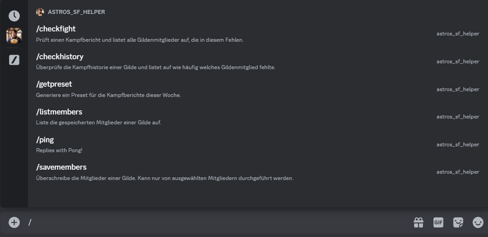
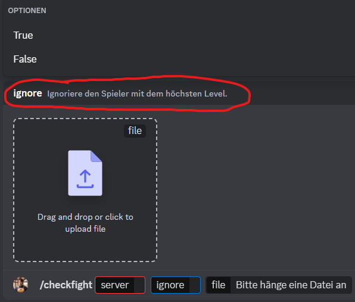

# sf_guild_helper_discord_bot

I'm not good with names. Lets call this Susi.
Susi is a small project of mine to support me in a Browser Game called Shakes & Fidget and it aims to help with one specific problem: Activity measurement of guild members in guild fights.

We all have this problem, some guild members are active, some are present and some are.. yeah. But it is hard to monitor which one never signs up for guild fights and so this application was born. With the help of discord as a platform, sftools as a helper and .har files this discord bot is able to check which guild member(s) did not show up to guild fights.

Be aware, this is not a automation or a "start and forget" application. You still need to capture the fights, update the list of guild members and need to feed the bot with fights.

She got developed with the intent to use one instance of the bot for one or multiple guilds.

## Project Status

Susi got developed on a rainy evening and is work in progress. There is not a lot of documentation inside the code, some things like helptexts are plain in german, the language of these texts are not configurable, this README needs a lot of love and some commands are tailored to me and not to everyone.

## Todo

- [ ] Finish README
- [ ] Add code documentation and remove german comments
- [ ] Let the bot post automatically missing members in an discord channel after /checkfight
- [ ] Use an discord Channel instead of a .txt file in /checkhistory
- [ ] Change option called server to something like guild

## Setup

### Setup Discord Application

Before we start to configure, build and run our bot we need to register her on discord. For this please open
<https://discord.com/login?redirect_to=%2Fdevelopers%2Fapplications>
and Login with your Discord Account.

After you successfully login press on the top right, next to your Avatar on "New Application" and give your Application a Name.
On the next page you can do a lot of things which are optional like setting up an Avatar for the bot, changing the name, adding a description and so on. But we will move on to the "OAuth2" category where we will find an Client ID which we need to copy for later.
Now we need to get a private Token to authenticate our bot, for this navigate to "Bot" on the sidebar and press "Reset Token" and copy the token too.

On the same page we need to scroll down to "Message Content Intent" and activate this permission. You don't need to save manual, this will happen automatically.

Again, on the same page (Category Bot), scroll further down till you find "Bot Permissions" and activate the fields "Use Slash Commands" and "Send Messages" in the row "TEXT PERMISSIONS" and copy the PERMISSIONS INTEGER Below the checkboxes.

### Setup config.json

In the same directory as this file you will find a `config.json.example`, please copy or rename this file to `config.json`.
Replace the placeholder value for `token` with the token you copied earlier.
Replace the placeholder value for `clientid` with the Client ID you copied earlier.
Modify the placeholder values for the `guild` array. At least one guild MUST BE there, you can name it like you want.

`userWithSavePermission` is a information i use right now to handle situations where the bot is accessible by a lot of users but only a few should write informations "into" the bot like the current guild officers. Like for `guilds` this is an array and can be filled up with a lot of discord user. For this i use the discord user id and to get this id you need to activate, as far as i know, the discord developer mode: <https://beebom.com/how-enable-disable-developer-mode-discord/> (Step 1 to 3). After this is done press right click on a member of your discord server to copy his id (should be the last option on the context menu) and paste it into the array of `userWithSavePermission`.

### How can you run this bot now?

Endless possibilities! You could run her locally on your pc from a cmdline, you could start her on an small server controlled through systemd and she is also prepared to run inside an Docker container.

#### Setup Docker

IMHO one of the easiest things if you know what to do. If you want to try out docker please visit <https://www.docker.com/get-started/> and when you can run the following command

```bash
docker run hello-world
```

successfully continue. After your local instance of docker is running please copy and execute inside a shell in the same directory as this file

```bash
docker build -t sf_discord_bot .
docker run --restart=always --name sf_discord_bot -v <absolute_workdir>/storage/:/usr/src/app/storage -v <absolute_workdir>/config.json:/usr/src/app/config.json -d sf_discord_bot
# get sure to adjust the mounting paths according to your file system
```

In theory everything should working now and with the command

```bash
docker logs sf_discord_bot
```

you should see something like

```txt
> sf-guild-helper-discord-bot@1.0.0 start
> node index.js

Got command: checkfight
Got command: checkhistory
Got command: getpreset
Got command: listmembers
Got command: savemembers
Started refreshing 5 application (/) commands.
Successfully reloaded 5 application (/) commands.
discord | Ready! Logged in as <yourbotname>#<id e.g. 4242>
```

### Update

Of course from time to time we want to update his software

```bash
# move into the workdir of this bot
cd <workdir>
# pull all updates through git
git pull
# remove old container
docker rm sf_discord_bot
# rebuild
docker build -t sf_discord_bot .
# run
docker run --restart=always --name sf_discord_bot -v <absolute_workdir>/storage/:/usr/src/app/storage -v <absolute_workdir>/config.json:/usr/src/app/config.json -d sf_discord_bot
# done, now the bot should be running again. Check this with logs command
docker logs sf_discord_bot
```

#### Setup directly with node

Docker is cool because you don't need to install a lot of things but sometimes you can't use it like on older kernels or in some virtual envs..
In such cases install node.js directly on your system. Please refer to <https://nodejs.org/en/download/> or <https://github.com/nvm-sh/nvm> and continue with this when you can successfully run `node -v`.

After node.js runs on your system open a shell and run

```bash
npm install
```

This installs all dependencies like the discord library i use and after this is finished you can start the bot with

```bash
npm run start
```

and like on the Docker way of life you should see something like the following output

```txt
> sf-guild-helper-discord-bot@1.0.0 start
> node index.js

Got command: checkfight
Got command: checkhistory
Got command: getpreset
Got command: listmembers
Got command: savemembers
Started refreshing 5 application (/) commands.
Successfully reloaded 5 application (/) commands.
discord | Ready! Logged in as <yourbotname>#<id e.g. 4242>
```

### Let the Bot land on your server

Nearly done! After our bot is running we can invite him onto one or multiple server. Do you remember the PERMISSIONS INTEGER you copied earlier in `Setup Discord Application`? Now we need this piece of information to let discord know with which privilegs we want to invite the bot on a server.

Please change `<clientid>` and if you have a different PERMISSIONS INTEGER than 2147485696 `<PERMISSIONS INTEGER>` too on the following url and open the url in an browser.

```txt
https://discord.com/api/oauth2/authorize?client_id=<clientid>&permissions=<PERMISSIONS INTEGER>&scope=bot%20applications.commands

https://discord.com/api/oauth2/authorize?client_id=<clientid>&permissions=2147485696&scope=bot%20applications.commands
```

You may need to login into Discord if you aren't already logged in, select the server you want to let the bot join and follow the steps off the wizard. Your Bot should be now on your server, congratulations!

## How to use the bot?

You may know that some bots use a command structure like `!ping` or `.ping` in messages as interface - we don't do this here.

We use Slashcommands and you can see and interact with them if you start to write a slash in the text input, an box with all available Bots and Commands should get opened. If you have a lot of bots on your server you can select your Bot on the left side of the box.



And if you selected the command you want to use (or wrote this command directly) you will see an interface for this command. Most of the times it will be something like the guild which will be used as reference, some options and depending on the command a file to transmit. Most of my options are configured as reguired, so you can't send the command with missing informations.
If you edit one option you will most of the time see a list of choicec and below an small info what is here required.



 Discords interface is very limiting on what we can display there and how long the text can be.. I tried to make any option and choice self explanatory but in cases where something is unclear feel free to get in touch with me.

## Commands

### /savemembers

This is the command you should try out at first after the setup. With this command you can update the members of your guild. There is only a save but this command will create and update everything we need and it works only with the whole guild and not single members.

To make this step a bit more easier (for me) i decided to use the help of an awesome project: <https://sftools.mar21.eu/>

If you don't use sftools already, shame on you!

Quick run down:

1. Open <https://sftools.mar21.eu/stats.html>
2. Navigate on the top to "Files"
3. Click on "Import from Game"
4. Insert your Username and Password and select as Capture mode "Capture own + guild characters"
5. Press on continue and wait till the scan is finished
6. Select the freshly made scan through the small round checkbox on the left of "Timestamp"
7. Press "Export selected" and select as Format "JSON File".
8. You can also select the checkbox for "Export only public data..." (The bot does not save any data except the names of guild members, but better save than sorry)
9. Press export

After we have our guild stored inside a small and compact json file open Discord and go to a server / channel where this bot is present and type into the text input `/savemembers`.
Like in `How to use the bot`? shown you should see a small box on the bottom of your screen, select the guild you want to update and select our exported .json file and press enter.
After a few second the bot should response to your with an success message and an information about how many guild members are now stored and which ones she found.

Every time the members of your guild change you need to do this step again.

### /checkfight

Next to `/savemembers` the core command right now. After we have stored the information about our guild (name of every member and the name of the first highest member) we can check with this command which members were not participating in an given guild fight. To do this we need to capture ONE fight in an .har file.

An explanation on how to do this you can find here [https://tinyurl.com/amht3fuk](https://tinyurl.com/amht3fuk)

But as a small run down:

1. Open the game
2. open the dev tools and open the "Network" Tab
3. Navigate to the fight mails
4. select the fight you want to check
5. Clear in dev tools -> network the complete log
6. press "show combat" in game
7. save the requests as .har file

After you have the .har file saved on your pc open discord and navigate to an server and channel where this bot is present and start writing `/checkfight`. A small box should appear to guide you through this process, enter the channel this .har file represents, enter if you want to automatically ignore the player with the highest level and add the saved .har file through the file browser and press enter.
After an short moment you should get an response like

```txt
Von 50 Mitgliedern wurden nur 47 erkannt.
Es fehlten: Alfred, Thomas, Martha
```

These players missed to register for the fight and you can do with this information now whatever you want.

Some important informations:
Since the addition of the fightadditionalplayers header inside the fight request, the player with the highest level will not be in this list if your guild is strong enough and he does not need to fight. For this reason we store the player with the highest level additionally to all players when using `/savemembers` and using this info in `/checkfight` if ignore is set to true.
This is kinda experimental at this point because i'm not entierly sure how the game handles this when multiple players will have the same level.. but i am optimistic that the current solution is also suitable for this.

I do not check if players were fighting with farm gear. I could do this but i think this is kinda unfair to players with an lower level because it is impossible to check this for players who did not fought in the fight.

This whole check is right now only useful for fights where your guild is the attacker. To make this suitable for fights where your guild is the defender we need to save in `/savemembers` together with the names of every player the stats of these too and compare the stored stats with the stats inside the fight. This comes with additional pain because you need a very clean scan as data basis in `/savemembers` where everybody needs to wear there best gear. Otherwise the checks in `/checkfight` will be screwed. And, you need to refresh this data regualary to keep up with gear updates from players.

### /listmembers

With this command you can read out which member of an given guild are right now saved inside this bot. After the call the corresponding .json file in `./storage/` will be opened and the members array will be posted as response.

### /getpreset

In the way i use this bot i have for every week one post in an discord channel to monitor the activity. As i want to have old posts inside this channel still there after a new week begins i just create a new post which i will edit through an week and to not have to copy the old post, edit out the players and change the date i created this command. Call `/getpreset` and as reponse you get a text which you can copy and paste directly without additional work todo.

This command and the response is tailored to me, so if you want to change it you can do this directly in `./services/discord/commands/getpreset.js`. Please be aware that the response is posted as a code block so that the formatting can be retained.

### /checkhistory

One times my guild leader asked me "which of our members is missing the most fights?" and i don't like to count this every time for myself and as i just copy and paste daily one or two fights i don't remember which member got written up the most. So for this i created this helper.
To use it go to your channel / place where you write down every fight and every missing member and copy every fight to an `.txt` file.
Stuff like the beginning of every day can stay in the file, other comments should be get deleted manually. THe file should look like:

```txt
Mo: JustChris, Chris, WeißerAdler, oNxKz, Vinux42
Di: Fitsch13, Meechy, InTrALeX, VivatKaczy
Mi: oNxKz, Meechy, InTrALeX, det0xka
Do: Nightdracon, oNxKz, Meechy, InTrALeX, Vinux42
Mo: Shanks, Lasresvese, Vinux42
Di: nein, Crankiee, oNxKz
Mi: Vinux42
```

Each line represents one fight, and as output after you called the command you get something like this:

```txt
Ergebnis:
Kämpfe erfasst: 35
Vinux42: 8 (23%)
Lasresvese: 7 (20%)
TankHulk: 7 (20%)
InTrALeX: 6 (17%)
```

The amount of fights we checked (should be correlate with the amount of lines in your `.txt` file) and how many fights every player has missed and how many fights there were missed as a percentage of the total number of fights checked. Be aware:

- Only players will appear who missed at least once
- in my preset from `/getpreset` you will see i mark players who missed an fight but gave a notice prior with a small `*` behind the name. These will not counted in the amount of missed fights.
- As we give the command the information about which guild we check only players who are currently in your guild (`./storage/<guild>.json`) are in this list.

## I added / changed commands and they do not get updated

In theory every time this bot starts she updates all her commands but sometimes Discord needs a few minutes to update them on the client too. Sometimes it helped to close the Discord Client completely and after an fresh start you can see and use the updated commands.
